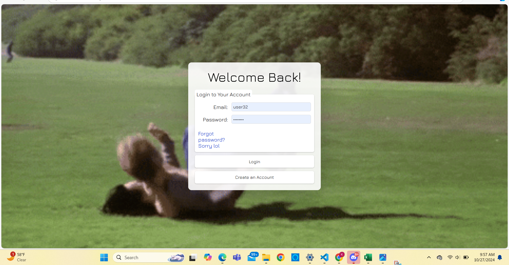
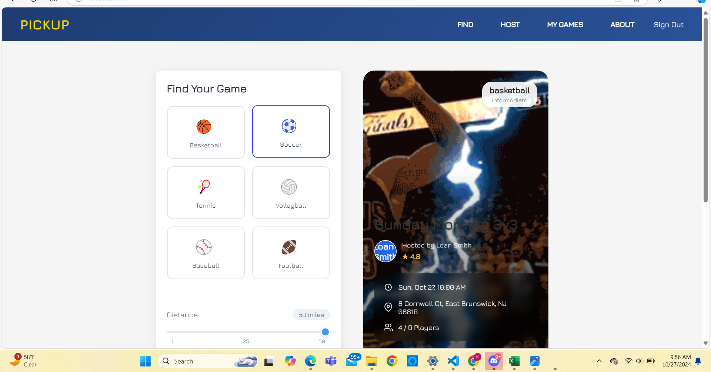
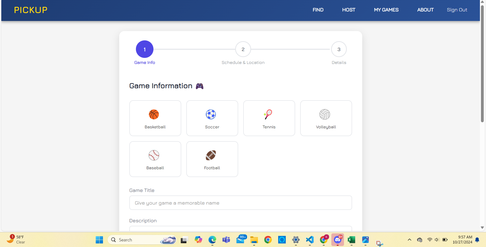

# PICKUP: Find Your Game 🏀⚽🎾🏐⚾🏈

## Tired of searching for players? Want to organize a spontaneous match or plan ahead? 🤔

**PICKUP** is the web app designed for sports enthusiasts like you! Connect with local players, find pickup games happening near you, or easily host your own games and build your sports community. Whether you're looking for a casual kickabout or a competitive match, PICKUP makes it simple to find and join the action. Get off the couch and onto the field! 💪

## ✨ Features

*   **Find Games Near You:** Discover active pickup games based on sport, location, and skill level. Never miss a game again! 📍
*   **Host Your Own Games:** Easily create and schedule games, set player limits, and manage attendees. Be the hero who organizes the next epic match! 🗓️
*   **Build Your Community:** Connect with other players and hosts who share your passion for sports. Find your sports tribe! 🤗
*   **Flexible Scheduling:** Organize spontaneous games or plan recurring events in advance. Your game, your rules, your time! ⏰
*   **User Profiles:** Showcase your preferred sports, skill levels, and connect with others. Let everyone know what you're about! 😎
*   **Interactive Game Cards:** Get all the details about a game at a glance, including location, time, players, and host info. All the info you need, right there! 👇

## 📸 Screenshots

Experience the flow of finding and hosting games:

**Welcome Back! (Login Page)**


**Find Your Game (Homepage)**


**Host a Game (Step 1: Game Info)**


*(More screenshots coming soon!)*

## 🧠 Our Recommendation System

What makes PICKUP special? We've built a custom recommendation engine to help you find games you'll truly enjoy!

*   **Data Labeling:** We started by carefully labeling our game data to understand the characteristics of different games (sport, location, skill level, etc.).
*   **Cosine Similarity:** Using the power of cosine similarity, we calculate how "alike" different games are based on their features. This mathematical approach helps us find games that are similar to ones you've liked or shown interest in.
*   **ML Algorithm:** We developed a machine learning algorithm that leverages this similarity matrix. When you interact with games (like or dislike), the algorithm learns your preferences and uses the cosine similarity scores to suggest other games you're likely to enjoy. The more you use the app, the better the recommendations get!

## 🚀 Get Started

Ready to jump into the game?

**Visit the hosted application:**
[https://pick-up-web-app.vercel.app/login](https://pick-up-web-app.vercel.app/login)

**To run the project locally:**

1.  Clone this repository.
2.  Navigate to the `pickup-frontend` directory.
3.  Install dependencies:
    ```bash
    npm install
    ```
4.  Start the development server:
    ```bash
    npm start
    ```
    This will open the app in your browser at [http://localhost:3000](http://localhost:3000).

*(Refer to the [pickup-frontend/README.md](pickup-frontend/README.md) for more detailed instructions on running the frontend.)*

## 🛠️ Technologies Used

PICKUP is built using a modern tech stack to provide a smooth and efficient experience:

### Frontend

*   **React:** A popular JavaScript library for building user interfaces. It allows us to create dynamic and responsive web pages.
*   **React Router:** Handles navigation within the application, providing a seamless single-page application experience.
*   **Firebase:** Used for user authentication (secure sign-up and login) and Firestore (a NoSQL cloud database) to store and manage game and user data.
*   **CSS:** Provides the styling and layout for the application, making it visually appealing and user-friendly.
*   **Vercel:** Our chosen platform for hosting the frontend application, providing fast and reliable deployment.

### Backend

*   **Flask:** A lightweight Python web framework used to build our backend API, which serves the game recommendations.
*   **Python:** The primary language for our backend logic, including the recommendation system.
*   **Firebase Admin SDK:** Allows our backend to securely interact with the Firebase database (Firestore) to fetch user data and game information.
*   **Pandas:** A powerful data manipulation library in Python, used for processing and working with our game data and the cosine similarity matrix.
*   **Cosine Similarity:** The core mathematical concept behind our recommendation engine, used to measure the similarity between games.

## 🤝 Contributing

We love contributions! Whether you're a developer, designer, or just have a great idea, we welcome your input.

*   **Found a bug?** Please open an issue!
*   **Have a feature request?** Open an issue to discuss it!
*   **Want to contribute code?** Fork the repository, create a new branch, and submit a pull request. Please follow our coding conventions (if any are established).

Let's build something awesome together! ✨

## 📄 License

This project is licensed under the [MIT License](LICENSE).

---

**PICKUP** - Don't just watch, play!